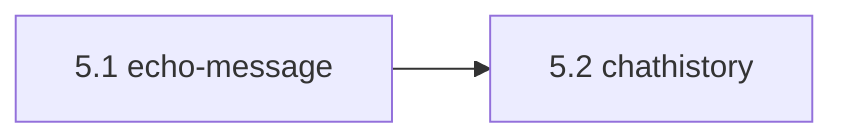

# Lingo roadmap

Planned features, in the order they should be built. Each item says why it exists, how it should work, which files it touches, and how to verify it. Uploads to the self-hosted teacup instance have their own plan in [teacup-uploads.md](teacup-uploads.md).

Out of scope, by decision: link previews, inline images, and any other fetching or embedding of third-party content.

Current baseline: schema `user_version = 10` includes per-user networks and sessions, account limits, synced user settings, server-backed read markers, unread counts, and highlights, and Web Push subscriptions. Appearance and browser notification choices remain in `localStorage`; mutes, hidden buffers, collapsed networks, highlight phrases, and `pushIncludesText` are synced. `public/` holds the web manifest, icons, the SVG favicon, and the push service worker (`sw.js`). `Transcript.tsx` renders URLs as plain text.

## Conventions for every item

- Storage changes add one migration step in `Store.migrate()` (bump `user_version` by one) and extend `tests/migration.test.ts` with an upgrade from the previous version. Never rewrite an earlier migration.
- New routes keep Zod validation, the same-origin check, session auth, and ownership checks (`ownsNetwork`/`ownedBuffer`). Admin routes live under `/api/users*` so the existing admin guard in the middleware applies.
- Contract changes go in `src/shared/contracts.ts` first, then update both the server and the client.
- Definition of done: `bun run build` and `bun test` pass; UI changes are exercised in a real browser; IRC changes are exercised against a mock peer (reuse the servers in `tests/irc.test.ts`); `AGENTS.md` is updated when invariants change.

Phase 4 (installable app with Web Push) is built; see `src/server/push.ts`, `src/client/push.ts`, and `public/sw.js`. Replayed chathistory messages (5.2) must bypass `IrcManager.pushNotify`.

---

## Phase 5: IRCv3

irc-framework 4.14 already requests `batch`, `message-tags`, `server-time`, `away-notify`, and `account-tag` (node_modules/irc-framework/src/commands/handlers/registration.js ~L138). Extra caps are requested with `client.requestCap()`, and `echo-message` with the `enable_echomessage` option, which `dial()` currently sets to `false` (irc.ts ~L891). Check which caps each network advertises before relying on them: `chathistory` is mainly offered by Ergo and soju.

### 5.1 Store message ids and use echo-message

**Why:** message ids are needed to de-duplicate history replayed by the server (5.2). echo-message also makes the stored timestamps and text of your own messages match the server's.

**Design**
- Migration: `messages.msgid TEXT`; `CREATE UNIQUE INDEX messages_msgid ON messages(buffer_id, msgid) WHERE msgid IS NOT NULL`.
- Declare `tags` on `IrcEvent` in `irc-framework.d.ts`. `incoming` stores `event.tags?.msgid`, and inserts with `INSERT ... ON CONFLICT DO NOTHING` (skip publishing when nothing was inserted).
- Set `enable_echomessage: true`. When the cap is enabled on a connection, `sendTo` does **not** record the message locally; the echoed copy is stored as an outbound message instead (sender equals our nick, so the read-marker rule from 3.2 applies). When the cap isn't available, keep today's local recording.

**Tests:** mock peer that supports echo-message: exactly one stored copy of a sent message, with the server's time. Mock peer without it: behaviour unchanged. A duplicate msgid is stored once.

### 5.2 History backfill with chathistory

**Design**
- Request `draft/chathistory` (and `chathistory`). After registration and after each self-JOIN, if the cap is enabled, send `CHATHISTORY AFTER <target> timestamp=<ISO of latest stored non-system message in the buffer> 200`. For private messages, use `CHATHISTORY TARGETS timestamp=<last disconnect> timestamp=<now> 50` and then `AFTER` for each target.
- Replayed messages arrive inside a `chathistory` batch (irc-framework `batch start/end chathistory`; commands carry `batch`). Store them through the same `incoming` path; messages without a msgid are de-duplicated on an exact `(buffer_id, time, nick, text)` match. Mark replayed events so they update unread counts but never trigger push or browser notifications.
- Add a per-network `backfill` toggle in `NetworkSettings.tsx`, default on when the cap is present.

**Tests:** mock peer answers `CHATHISTORY` with a batch that includes one already-stored msgid and one new message: only the new one is stored, and no push is sent.

### 5.3 Typing indicators

**Design**
- Receive: `client.on('tagmsg')` with `tags['+typing']` set to `active`, `paused`, or `done` produces an ephemeral `ServerEvent` `{ type: 'typing', bufferId, nick, state }`. It isn't stored and is sent to the owner only. The client shows "alice is typing…" above the composer and expires the entry after 6 s without an update.
- Send: only when `sendTyping` (3.1, default **off**) is on. The composer calls `POST /api/buffers/:id/typing` with `{ state }`, throttled to one call every 3 s, plus `done` when sending or clearing. The server calls `runtime.client.tagmsg(target, { '+typing': state })` if `message-tags` is enabled, and does nothing otherwise.

**Tests:** mock peer: a TAGMSG in produces an event; a POST sends a TAGMSG out only when the setting is on.

---

## Phase 6: Data ownership

### 6.1 History export

**Design**
- `GET /api/buffers/:id/export?format=txt|jsonl&since=&until=` and `GET /api/networks/:id/export?format=jsonl`. Both stream a `ReadableStream` that pages through rows in ascending id order, 1000 per page, so exports never load everything into memory. They set `Content-Disposition: attachment` with a sanitised `<network>-<buffer>-<yyyy-mm-dd>.<ext>` filename. Ownership checks apply.
- Text format: `[2026-09-23T12:00:00Z] <nick> text`, `* nick action`, `-nick- notice`, `-- system`. JSONL: one `ChatMessage` per line, plus `bufferName` in network exports.
- UI: an "Export history…" item in the buffer and network context menus (`App.tsx` menu builders), with a format picker.

**Tests:** an export larger than one page keeps order and is complete; time filters are inclusive; another user's id returns 404.

---

## Phase 7: Smaller UX items

### 7.1 Unread markers in the tab title and favicon
Needs 3.2. The title is `(N) Lingo`, where N is the number of unmuted mentions, or `• Lingo` when there are only ordinary unread messages. The favicon is `public/favicon.svg`, redrawn on a canvas with a red dot for mentions and a grey dot for ordinary unread messages. Update both from one derived value in `App.tsx`.

### 7.2 Keyboard navigation and quick switcher
- Alt+↑/↓: previous/next visible buffer. Alt+Shift+↑/↓: previous/next unread buffer, mentions first. Alt+1…9: buffer by sidebar position. On macOS, Option+digit types characters into inputs, so these handlers must `preventDefault` and match on `event.code`.
- Ctrl/Cmd+K opens a fuzzy buffer switcher (a new `QuickSwitcher.tsx`). Today both `f` and `k` open search (`App.tsx` L421); keep search on Ctrl/Cmd+F.
- Add a short shortcut list in Settings.

### 7.3 Per-network connect options
Add `networks.join_delay_seconds` (0–30) for networks where you must identify with NickServ before joining (to get a host cloak). Add a "regain nick" option: when the preferred nick is taken and a SASL account is configured, send `NickServ REGAIN <nick>` after registration. Both go in `NetworkSettings.tsx`. Test both with a mock peer.

### 7.4 Clickable links (optional, needs sign-off)
Render `http(s)://` URLs in `Transcript.tsx` as `<a target="_blank" rel="noopener noreferrer nofollow" referrerpolicy="no-referrer">`. No fetching, no previews, no media. The main use is opening teacup links.
